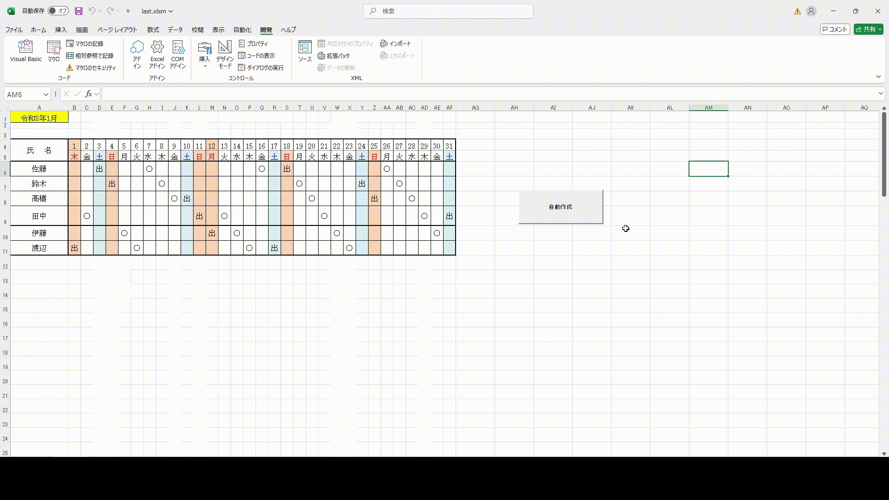

# VBAを使ってスケジュール作成自動化

ユーザーの入力と前回の最後の「〇」と「出」をもとに、日付や休日、祝日を修正し、順番に「〇」と「出」がまわるようにします。
## 開発背景
社内の遅番・休日出勤の分担表作成で、毎回同一の初期設定作業が発生している非効率を把握しました。そこで Excel/VBA でテンプレート生成を自動化するツールを作成し、初期作業をワンクリックで完了できるようにしました。結果として、分担表の立ち上げ時間を短縮し、ヒューマンエラーの削減にも寄与しました。